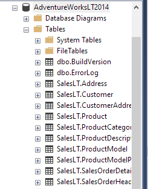
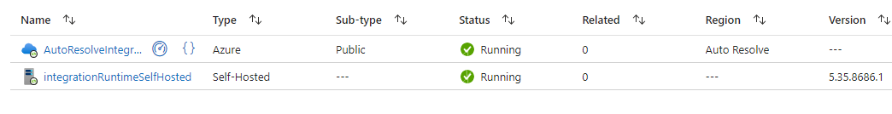

## Data Pipeline For ON-Premise SQL Database

### Overview
This project aims to create a comprehensive data transformation pipeline for Azure Data Lake Storage Gen2. The pipeline will handle data ingestion, processing, transformation, and storage using ADF , Synapse Analytics and Azure Databricks.

#### Pipeline 1 :AdventureWorks Database Integration And Transformation
- **Data Ingestion:** Raw data from the AdventureWorks database on an on-premise SQL Server will be ingested into Azure Data Lake Storage Gen2 (`ingested-data` container) using Azure Data Factory's self-hosted integration runtime with SQL authentication. \
Database Preview:

Create Self-hosted Integeration Runtime on local Machine:

- **Data Extraction:** Using Azure Data Factory's Lookup activity, the pipeline will retrieve the table names and schemas of the SalesLT schema from the AdventureWorks database. The foreach activity will iterate over each table and use the Copy activity to load the data into Azure Data Lake Storage Gen2 as Parquet files.
- **Data Transformation :** Using Spark DataFrame operations, the data will be standardized, cleaned, and being stored in the `transformation-1` container.
- **Data Normalization:** Column names in the transformed data will be normalized to ensure consistency.
- **Data Loading:** Transformed data will be loaded into the `transformation-2` container in Delta format. \
`Converting Parquet tables to Delta format using Databricks adds additional capabilities, such as ACID transactions, time travel, and schema enforcement, making it easier to manage and evolve your data pipelines over time.`
  

#### Pipeline 2 : Create Views for Each table
- **Create Views:** Views will be created in Azure Synapse Analytics to enable querying of the Parquet files stored in Azure Data Lake Storage Gen2.
  
### Technologies Required
- Apache Spark
- Azure Databricks
- Azure Data Lake Storage Gen2
- Azure Synapse Analytics
- Azure Data Factory

### Objectives
- Ingest raw data into Azure Data Lake Storage Gen2.
- Process and transform raw data into a parquet format.
- If Date column is present in tables transform into YYYY-MM-DD format
- Normalize column names in the transformed data from camelCase to Snake_Case
- Load transformed data into Azure Data Lake Storage Gen2 in Delta format.
- Create views in Azure Synapse Analytics for querying transformed data.

### Benefits
- Improved data quality and consistency : Standardize data formats, such as dates
- Enhanced data accessibility and query performance : Normalize column names
- Scalable and efficient data processing : Convert to Delta Format.

### Conclusion
These projects provide robust data transformation pipelines for Azure Data Lake Storage Gen2, enabling organizations to derive valuable insights from high-quality, standardized data.

