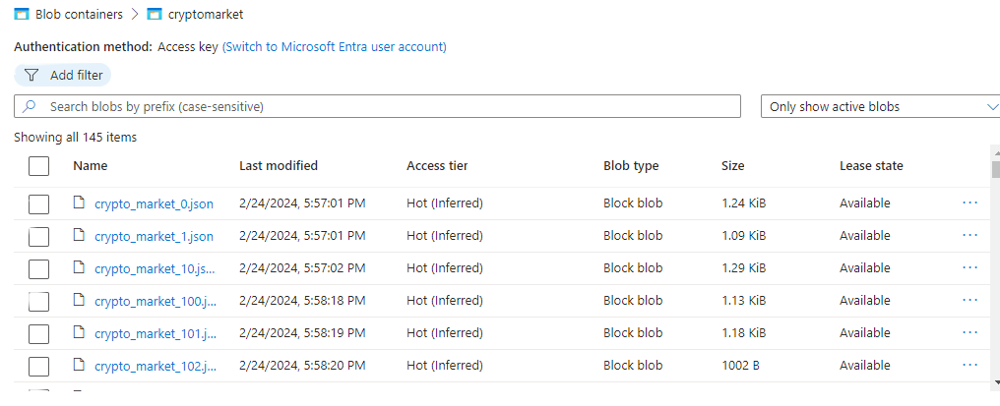
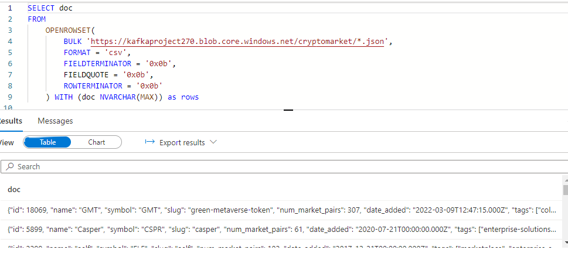

### Project Description: Real-time Cryptocurrency Market Data Pipeline

#### Overview
This project aims to build a real-time data pipeline for collecting, processing, and storing cryptocurrency market data using Kafka, Azure Blob Storage, and the CoinMarketCap API. The pipeline consists of two main components: a producer that fetches data from the API and publishes it to a Kafka topic, and a consumer that reads data from the Kafka topic and uploads it to Azure Blob Storage.

#### Technologies Used
- **Kafka:** A distributed streaming platform for handling real-time data feeds.
- **Azure Vm** : A virtual machine to run kafka servers.
- **Azure Blob Storage:** A cloud-based storage solution for storing large amounts of unstructured data.
- **CoinMarketCap API:** An API for accessing cryptocurrency market data.
- **Python:** It is used for implementing the data pipeline.

#### Workflow
1. **Data Extraction**
   - Use the CoinMarketCap API to fetch the latest cryptocurrency market data.
   - Handle potential connection errors and timeouts.
   - The producer to connect to the Kafka broker running on the Azure VM with the IP address 20.197.15.167 and port          9092.

2. **Data Transformation**
   - Convert the fetched data into JSON format for compatibility with Kafka.

3. **Data Ingestion**
   - Use KafkaProducer to publish the data to a Kafka topic named "crypto".
     
```python
producer = KafkaProducer(bootstrap_servers=["20.197.15.167:9092"],
                        value_serializer=lambda x: dumps(x).encode("utf-8"))
for data in data_list:
    producer.send('crypto', value=data)
    sleep(1)
print("Data sent to Kafka topic successfully")

```  
You can see the full KafkaProducer python code for data extraction is [HERE.](Files/KafkaProducer.ipynb)

4. **Data Storage**
   - Use KafkaConsumer to consume messages from the "crypto" topic.
   - Upload each message to Azure Blob Storage as a JSON file in a container named "cryptomarket".
   
```python
 for count, message in enumerate(consumer):
     # Convert message to JSON format
     message_json = json.dumps(message.value)
     
     # Create a blob client with a dynamically generated name
     blob_name = "crypto_market_{}.json".format(count)
     blob_client = container_client.get_blob_client(blob_name)

     # Upload the JSON data as the blob content
     blob_client.upload_blob(message_json, overwrite=True)
```
You can see full KakfaConsumer code is [HERE.](Files/KafkaConsumer.ipynb)



5. **External Table**
   - To query all the json files by KafkaConsumer we required to create a external table in serverless pool.

