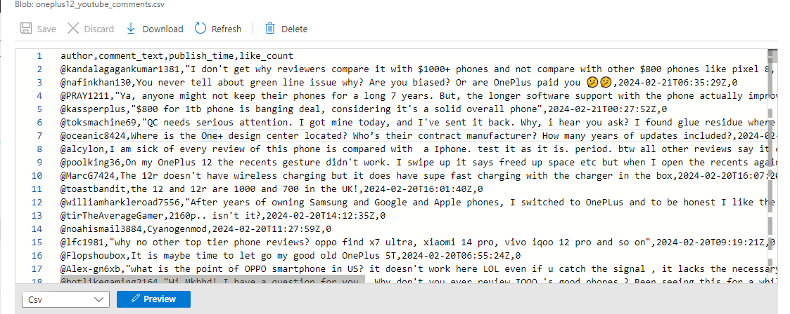

# Data Engineering Project: YouTube Comments ETL

## Project Overview
This project focuses on extracting, transforming, and loading (ETL) YouTube comments data using the YouTube Data API and Azure Blob Storage. The goal is to collect comments from a specific YouTube video, process them into a structured format, and store them in Azure Blob Storage for further analysis. Airflow is used to orchestrate the whole ETL process.

## Tools and Technologies Used
- Azure VM instance
- Google API Client Library for accessing the YouTube Data API
- Pandas for data manipulation
- Azure Storage Blob SDK for interacting with Azure Blob Storage
- Apache Airflow for workflow management

## Data Extraction
The project starts with extracting comments from a YouTube video using the YouTube Data API. Google has simplified their API usage, providing an API explorer that lets me see the returned data directly within explorer itself.

In my youtube_etl code i used `extract_data()` function  to fetches comments in batches using pagination to ensure all comments are retrieved.
Some videos have more tahn on page of comments. I used a while looop taht looked for the nextPageToken in each response to retrieve all comments. Whenever another page of comments was available, the response would include anextPageToken.

```python
   while True:
        request = youtube.commentThreads().list(
            part="snippet,replies",
            videoId="YOUR_VIDEO_ID",
            pageToken=nextPageToken
        )
        response = request.execute()
        response_collection.extend(response["items"])
        nextPageToken = response.get("nextPageToken")
        if not nextPageToken:
            break
```
            
## Data Transformation
Once the comments are extracted understanding the data and its structure and getting and getting the data I needed. CommentsThreads endpoint offers a list of comment threads. I needed to extract each comment from the list.
The `transform_data()` function processes the raw comment data into a structured format. It extracts relevant information such as the author's name, comment text, publish time, and like count for each comment.

```python
   comments = []
    for item in response_collection:
        comment = item["snippet"]["topLevelComment"]["snippet"]
        author = comment["authorDisplayName"]
        comment_text = comment["textOriginal"]
        publish_time = comment["publishedAt"]
        like_count = comment["likeCount"]
        comment_info = {
            "author": author,
            "comment_text": comment_text,
            "publish_time": publish_time,
            "like_count": like_count
        }
        comments.append(comment_info)

    return pd.DataFrame(comments)
```
## Data Loading
The transformed data is then loaded into Azure Blob Storage using the `load_data()` function. The data is saved as a CSV file in a specified container in the Azure Blob Storage account.


Please refer to this for full code [HERE.](Files/youtube_etl.py)


## Airflow DAG
The ETL process is orchestrated using Apache Airflow. A DAG (Directed Acyclic Graph) named `youtube_etl` is created with a single task `run_etl_task` that executes the ETL process. The DAG is scheduled to run daily to ensure that new comments are captured regularly.
Youtube_ETL code is [HERE.](Files/youtube_dag.py)

## Conclusion
This project demonstrates an ETL pipeline for processing YouTube comments data using the Google API. Extracted data in CSV format can be further analyzed for sentiment analysis and used to recommend improvements for future YouTube videos. 

I extracted the comments of the newly launched OnePlus device, which helps the manufacturer analyze the comments to see how the public reacts to their products and make further improvements.

