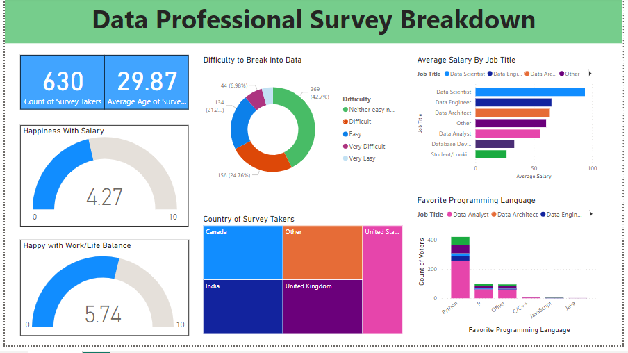

# Project: Professional Survey Dashboard

## Overview
In this project, I created a dashboard in Power BI to visualize and analyze the dataset "data_professional_survey" This dataset contains information about data professionals, including their demographics, job roles, salaries, and more. The goal of the dashboard is to provide insights into the characteristics and trends of data professionals based on the survey data.

## Dataset Description
- **Dataset Name:** data_professional_survey
- **Description:** The dataset contains 630 rows. It includes information such as age, gender, job title, years of experience, salary, etc.

## Dashboard Features
- **Overview:** A summary of key metrics and trends in the dataset.
- **Demographics:** Visualizations showing the distribution of data professionals by location.
- **Job Roles:** Charts showing the distribution of job roles among data professionals with salaries.
- **Salary Analysis:** Visualizations comparing salaries with happiness.
- **Skills:** Visualizations highlighting the most favorite programming languages among data professionals.

## Dashboard Screenshots

## Project Outcome
- The dashboard provides a comprehensive view of the dataset showing prfessional are not happing with their salaries below **5** in **0 - 10** scale and work/life is also average below **6**.
- The favorite programming language is **python**.
- **Forty Five percent** professional things is not neither easy nor difficult.
-  Highest salary takers are **Data Scientist** among data professionals.
  
The dashboard can be used by HR professionals, recruiters, and data enthusiasts to understand the current landscape of the data profession.

