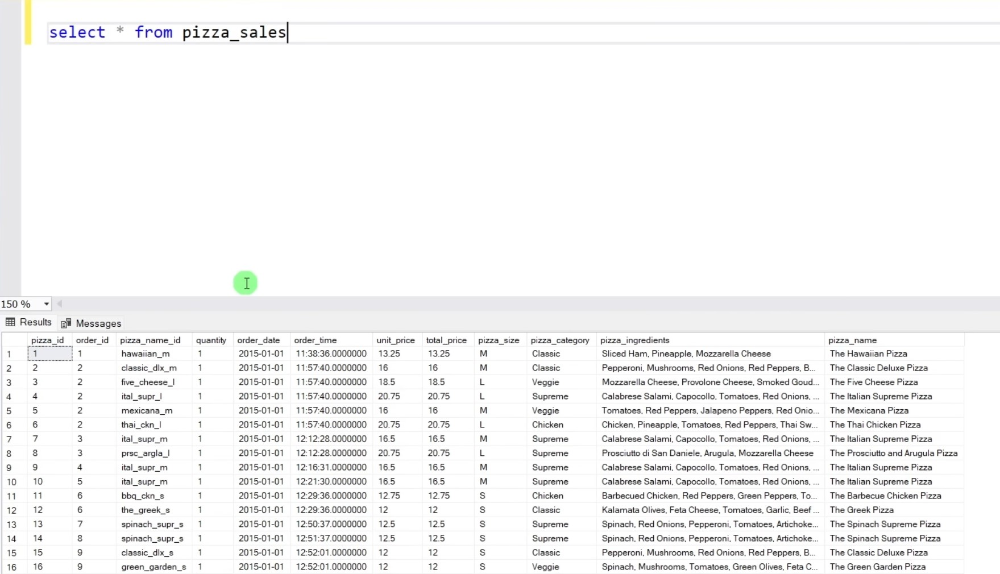
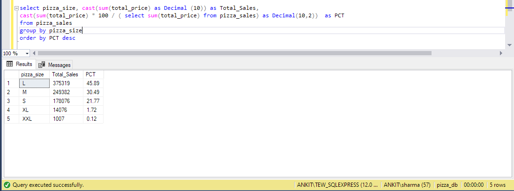
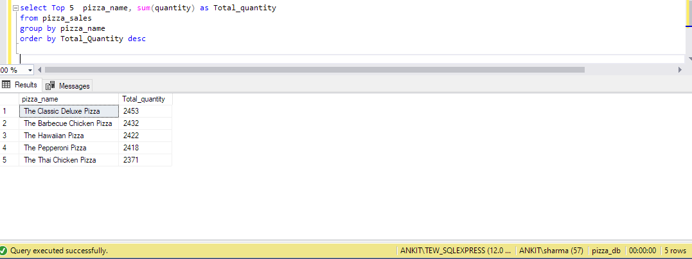
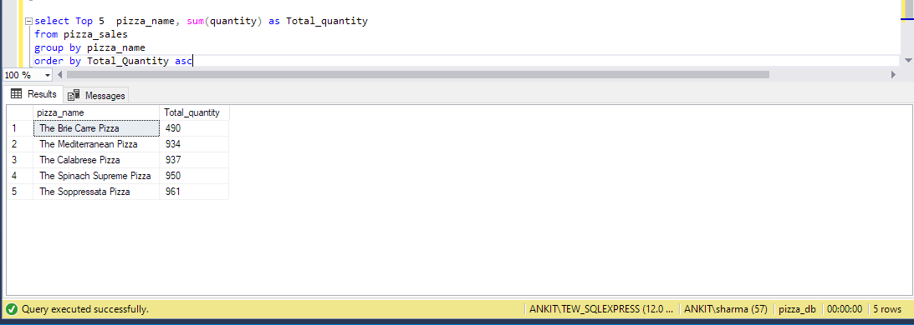
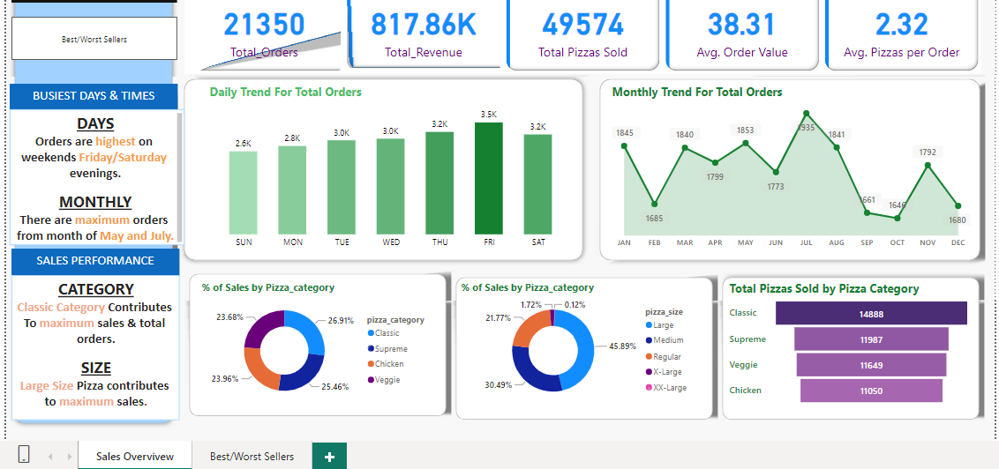
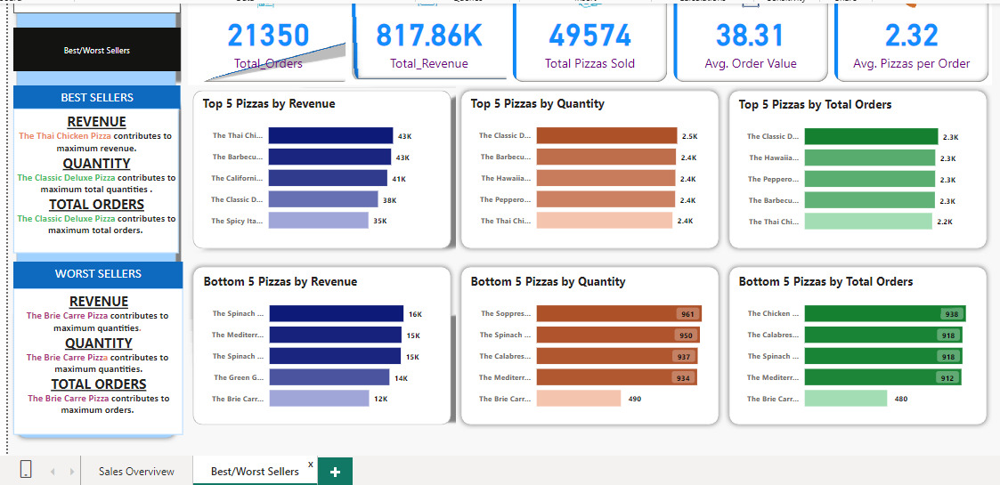

# SALES OVERVIEW 
### Project overview
* This project explores different business metrics and how they can be displayed graphically.
* I explore the relation between sales and products
* We can obtain conclusions that will help us to make better marketing campaigns and improve profits
* Tools used include MsSQL Server for data querying and Power BI for visualization.

### Objectives:
The goal is to build a sales report that shows summarized information about the business´s current situation to understand how to make more profits. 

The most important indicators are sales, top products & worst products.

### About Dataset:
Data set contains sales information of pizzas. \
Data set contains 48620 rows and 12 columns.

### Data Queries Result

-  Top 5 best pizza size with their sales percent
-  

- Top 5 pizza by sales quantity

- Bottom 5 pizza by sales quantity

You can see all the SQL queries **[HERE](https://github.com/As2909/Projects/blob/main/Sales%20Analysis%20Project/Files/Pizza%20Sales.sql)**

### Visualizations 
The final product is a 2 pages dashboard. The first one tell us sales overview and other one is about worst/best sellers pizzas.

You can download the final dashboard by clicking **[HERE](https://github.com/As2909/Projects/blob/main/Sales%20Analysis%20Project/Files/Pizza%20Sales%20Report.pbix)** or see the image below

**Sales Overview**

**Best/Worst Sellers**

### Conclusions
* The best day of a week is Friday for sales and best months is from May to July.
* The sales after July to October is decresing.
* The Classic category and L (Large) pizza size contribute most sales.
* The Chicken category and XXL (X-X-Large) pizza size contribute lowest sales.
* The best pizza name is The Classic Deluxe Pizza and worst is The Brie Carre Pizza.

