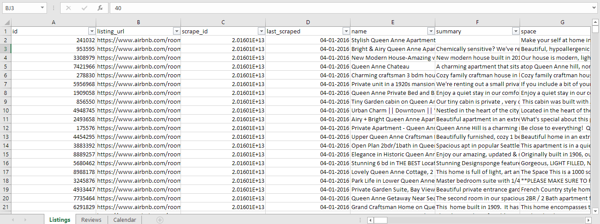
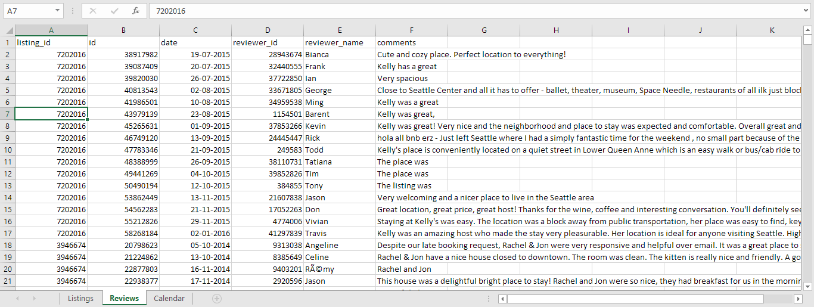
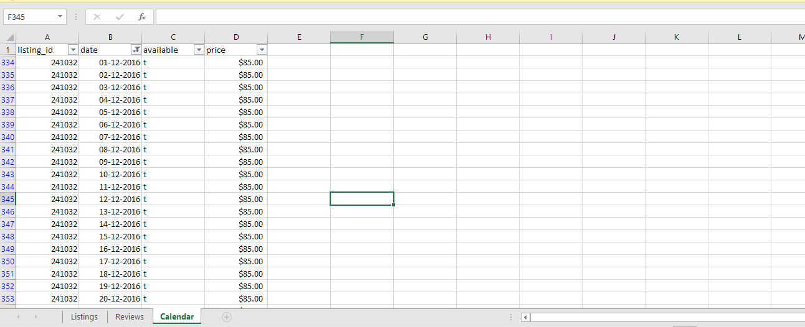
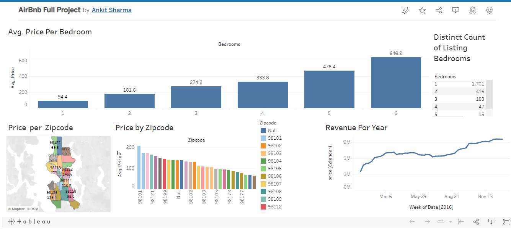

## Airbnb
Since 2008, guests and hosts have used Airbnb to expand on traveling possibilities and present a more unique, personalized way of experiencing the world. Today, Airbnb became one of a kind service that is used and recognized by the whole world. Data analysis on millions of listings provided through Airbnb is a crucial factor for the company. These millions of listings generate a lot of data - data that can be analyzed and used for security, business decisions, understanding of customers' and providers' (hosts) behavior and performance on the platform, guiding marketing initiatives.

### We have 3 Dataset.
- Sheet_name = Listings
- Sheet_name = Calendar
- Sheet_name = Reviews

You can see the source dataset  **[HERE](https://www.kaggle.com/datasets/alexanderfreberg/airbnb-listings-2016-dataset)**

#### Dataset - Listings
- We have 92 columns and 3818 rows
  

#### Dataset - Reviews
- We have 6 columns and 84849 rows

#### Dataset - Calendar
- We have 4 columns and 1 M rows
- 4 columns -> listing_id & date & available & price
  

#### Tasks:
- Calculate the Avg.Price Per Bedroom
- Distinct Count of Bedroom Listings
- Price Per Zipcode
- Revenue for Year

#### Final Dashboard

You can also see my dashboard **[HERE](https://public.tableau.com/app/profile/ankit.sharma4125/viz/AirBnbFullProject_16946089051120/Dashboard1)**

#### Conclusion:
- The avg.price per bedroom for 6 room is highest if we focus to sell these more we gain more profit.
- One room set having highest listings.
- The zipcode 98101 have highest buys.
- Monthly revenue for a year is constant increases but there is slight down in months of April to June.
